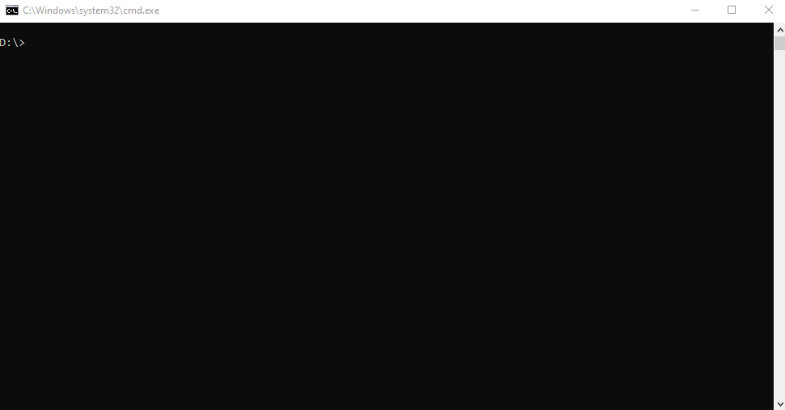
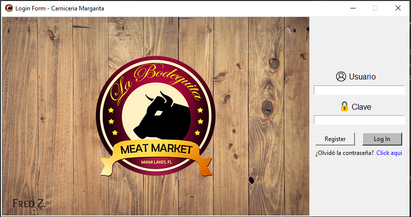
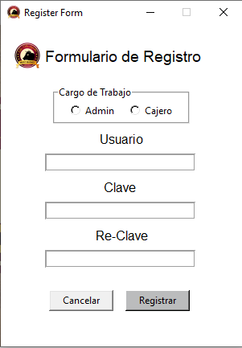
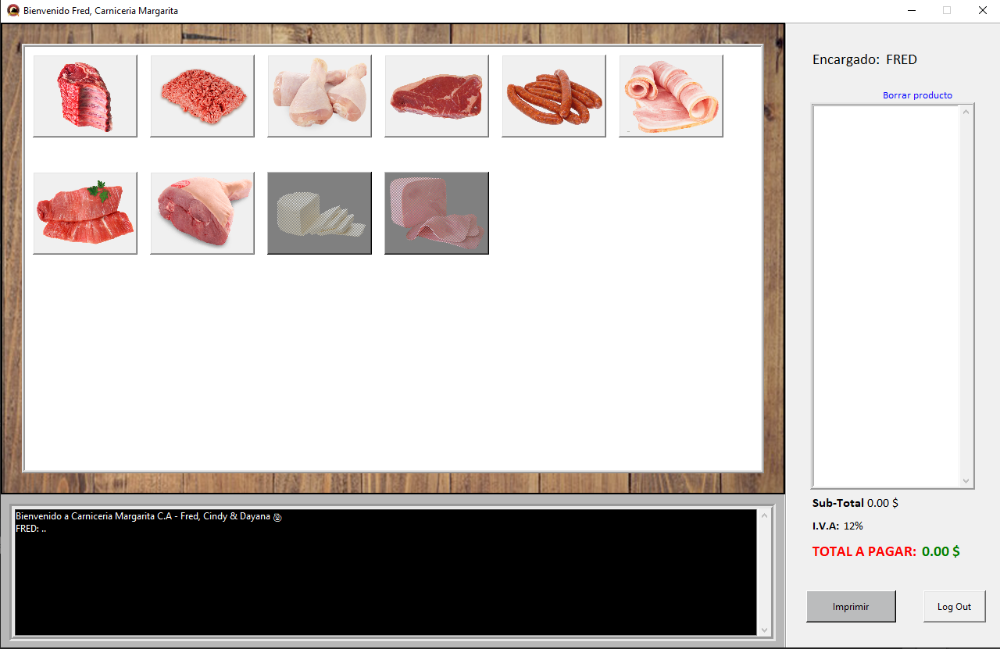

# Carniceria Margarita

Es un proyecto planteado por la materia Programacion, en el pensum de la carrera
Ingenieria de Sistemas, de la [Universidad de Margarita](http://www.unimar.edu.ve/unimarportal/index.php),
estado Nueva Esparta, Venezuela.

##### Enfoque del Proyecto
```
Se requiere crear un programa con interfaz gráfica, bajo un enfoque orientado a objetos,
ajustado a sus necesidades. Este debe manejar un módulo para inicio de sesión y 
registro de dos tipos de usuario, cuyas funcionalidades serán asignadas por ustedes, 
dependiendo del área de la empresa seleccionada.
Cabe destacar que los aspectos a evaluar serán los siguientes:
    - Diseño
    - Funcionalidad
    - Validación
    - Código
    - Trabajo en equipo
    - Herramientas tecnológicas empleadas
```

## Instalación

#### Pillow

Pillow es el amigable fork, realizado por Alex Clark y Contribuidores. 
PIL es Python Imaging Library, hecho por Fredrik Lundh y Contribuidores.

Usa el Package Manager [pip](https://pip.pypa.io/en/stable/) para instalar PIL



##### Windows

```bash
pip install Pillow
```

Si ya posee Pillow puede actualizarlo con

```bash
pip install --upgrade Pillow
```

##### Linux

```bash
python3 -m pip install --upgrade pip
python3 -m pip install --upgrade Pillow
```

##### MacOs

```bash
python3 -m pip install --upgrade pip
python3 -m pip install --upgrade Pillow
```

Dato Importante tenga en cuenta que necesita desinstalar PIL, para poder usar Pillow

Una vez instalado Pillow, para el manejo de Imagenes de este proyecto, puede clonarlo 
y correrlo en su ordenador.

## Visualizacion del Proyecto






## Contribución

Este proyecto esta abierto a contribuciones, las contribuciones pueden ser simples desde
un pequeño ``messagebox`` hasta la creacion de varios modulos, el unico requerimiento
es que este tenga relevancia con respecto al proyecto.

El proyecto tambien posee Modulos de funciones `functions.py`, el cual esta creado para
matener funciones de uso general durante todo el programa. Ejemplo:

```python
from functions import center_window

# center_window, sirve para centrar al centro de la pantalla las ventanas emergentes,
# funciona en todos los ordenadores. Esta funcion toma tambien como paramentros 
# el ancho y alto de la ventana

root = Tk()
center_window(root, 800, 600)
root.mainloop()
```

## Licencia

[MIT](https://choosealicense.com/licenses/mit/)

```buildoutcfg
MIT License

Copyright (c) 2020 Fred Zerpa Gil

Permission is hereby granted, free of charge, to any person obtaining a copy
of this software and associated documentation files (the "Software"), to deal
in the Software without restriction, including without limitation the rights
to use, copy, modify, merge, publish, distribute, sublicense, and/or sell
copies of the Software, and to permit persons to whom the Software is
furnished to do so, subject to the following conditions:

The above copyright notice and this permission notice shall be included in all
copies or substantial portions of the Software.

THE SOFTWARE IS PROVIDED "AS IS", WITHOUT WARRANTY OF ANY KIND, EXPRESS OR
IMPLIED, INCLUDING BUT NOT LIMITED TO THE WARRANTIES OF MERCHANTABILITY,
FITNESS FOR A PARTICULAR PURPOSE AND NONINFRINGEMENT. IN NO EVENT SHALL THE
AUTHORS OR COPYRIGHT HOLDERS BE LIABLE FOR ANY CLAIM, DAMAGES OR OTHER
LIABILITY, WHETHER IN AN ACTION OF CONTRACT, TORT OR OTHERWISE, ARISING FROM,
OUT OF OR IN CONNECTION WITH THE SOFTWARE OR THE USE OR OTHER DEALINGS IN THE
SOFTWARE.
```